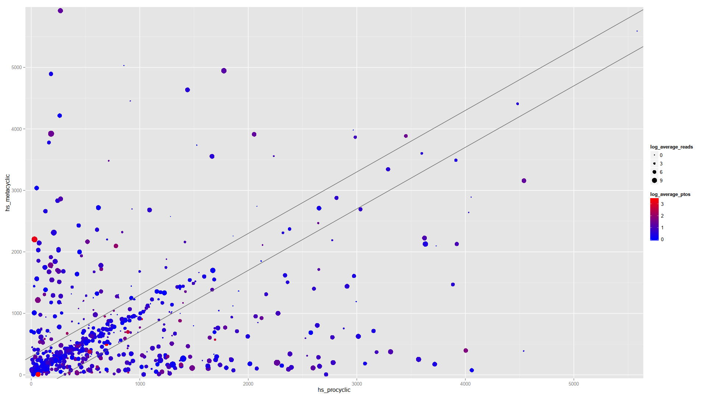

UTR Length and Alternative Trans-splicing / Poly-adenylation Analysis
=====================================================================

Overview
--------

The purpose of this analysis is to provide some basic statistics and
visualizations relating to Trypanosome UTR length and composition, and
alternative trans-splicing and poly-adenylation site usage.

In particular, this code was designed to use the output from [UTR Analysis
Pipeline](https://github.com/elsayed-lab/utr_analysis) which uses
RNA-Sequencing reads to detect trans-splicing acceptor sites and
poly-adenylation sites. The output from this pipeline consists of two GFF
files: one which contains all detected spliced leader (SL) sites, and another
containing all detected Poly-adenylation sites. For each site, a score is
provided indicating the number of reads supporting each site.

Output
------

### Summary CSV files

For each condition (e.g. parasite developmental stage) included, a
comma-separated-value (CSV) file is generated summarizing the primary site
length, primary and secondary site usage, and GC- and CT-richness for the UTRs
defined by the primary SL/Poly(A) sites, e.g.:

    name,length,num_reads,num_reads_primary,num_reads_secondary,gc,ct
    LmjF.01.0010,353,1826,1544,257,0.584,0.708
    LmjF.01.0020,193,1386,869,358,0.627,0.668
    LmjF.01.0030,589,1192,1089,76,0.601,0.61
    LmjF.01.0040,324,1694,1152,196,0.642,0.645
    ...

### Summary GFF files

A GFF is also generating representing the consensus UTR boundaries across all
conditions:

    LmjF.01	El-Sayed	five_prime_UTR	4703	5054	3088	-	.	ID=LmjF.01.0010_5utr;Name=LmjF.01.0010;description=hypothetical+protein,+unknown+function
    LmjF.01	El-Sayed	five_prime_UTR	7440	7631	1738	-	.	ID=LmjF.01.0020_5utr;Name=LmjF.01.0020;description=hypothetical+protein,+conserved
    LmjF.01	El-Sayed	five_prime_UTR	11068	11655	2178	-	.	ID=LmjF.01.0030_5utr;Name=LmjF.01.0030;description=MCAK-like+kinesin,+putative
    LmjF.01	El-Sayed	five_prime_UTR	12643	12965	2304	-	.	ID=LmjF.01.0040_5utr;Name=LmjF.01.0040;description=hypothetical+protein,+unknown+function
    LmjF.01	El-Sayed	five_prime_UTR	17023	17200	2652	-	.	ID=LmjF.01.0050_5utr;Name=LmjF.01.0050;description=carboxylase,+putative
    ...

### Stage comparison CSV files

For each pair of conditions (usually parasite developmental stages) defined in
the settings, a CSV file is generating describing site usage across the stages:

    ,name,stage1_len,stage2_len,len_diff,average_primary_site_num_reads,average_ptos_ratio,count_average,stage1_stage2_ratio_stage1_samples,stage2_stage1_ratio_stage2_samples,log_average_ratio,length_diff,log_average_reads,log_average_ptos,log_length_diff
    1,TcCLB.401569.10,128,142,14,2,1,2,2,2,1,14,1,0,3.8073549220576
    2,TcCLB.401661.10,769,56,713,1,1,1,1,1,0,713,0,0,9.47775826644389
    3,TcCLB.404001.20,290,313,23,1,1,1,1,1,0,23,0,0,4.52356195605701
    4,TcCLB.404843.20,626,401,225,151.5,1.25729813664596,151.5,1.02173913043478,1.49285714285714,0.330326789186029,225,7.24317398347295,0.330326789186029,7.81378119121704
    5,TcCLB.405165.10,256,297,41,3.5,2.25,3.5,2,2.5,1.16992500144231,41,1.8073549220576,1.16992500144231,5.35755200461808
    6,TcCLB.407477.30,22,15,7,1,1,1,1,1,0,7,0,0,2.8073549220576
    ...

### Stage comparison Figures

Finally, a figure is generated for each pairwise stage comparison summarizing 
the information in the above CSV file (see example at top of README.)

References
----------

- Dillon, L. a. L., Okrah, K., Hughitt, V. K., Suresh, R., Li, Y., Fernandes,
  M.  C., … El-Sayed, N. M. (2015). [Transcriptomic profiling of gene
  expression and RNA processing during Leishmania major
  differentiation](http://www.ncbi.nlm.nih.gov/pmc/articles/PMC4538839/).
  Nucleic Acids Research, 43(14), gkv656. doi:10.1093/nar/gkv656

